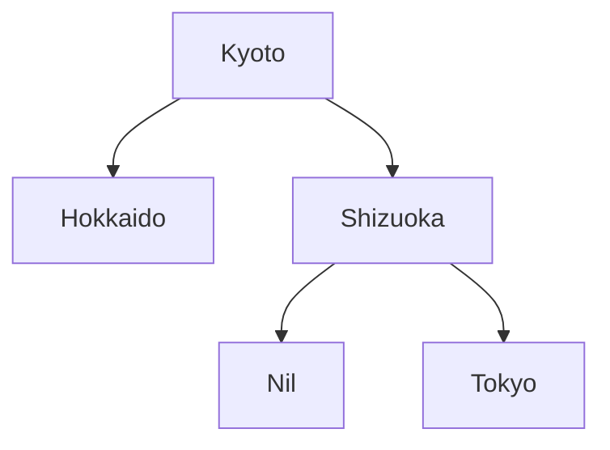

# Chapter 5. ２分木探索

Haskell の動作を理解しやすくするために、簡単な２分木探索のプログラムを作成してみます。

**２分木** とは、下の 図Ａ にあるように、Node（結び目）のところにあるものより小さいものは左側へ、
大きいものは右側へ格納していく構造のものです。

**図Ａ**


## ２分木のデータ構造を作る

以下が２分木を生成するプログラムとなります。<br>
学習のために、一般的に Haskell で定義される２分木と少し形を変えています。

**Tree.hs**
```Haskell
data Tree a =
    Node a (Tree a) (Tree a)
    | Leaf a
    | Nil
    deriving Show
```

`Tree` の定義で、留意すべきことは以下の２点になります。　

* `Tree a` と形変数 `a` が付随している。`Tree` は何かを格納するものなので、格納する型を `a` と表している。

* 型構築子と値構築子がうまく組み合わされている。<br>
`Node a (Tree a) (Tree a)` と書くことにより、`Node a A B` の `A` や `B` の部分には、
`Leaf a` が入っても良いし、`Nil` が入っても良い。さらに、再帰的に `Node a X Y` が入っても良い。

次に、図Ａ の木構造を `Tree a` を使って実際に作ってみると以下のようになります。

**リスト１**
```
ghci> :l Tree.hs
ghci> t = Node 4 (Leaf 2) (Node 7 (Leaf 5) Nil)
ghci> t
Node 4 (Leaf 2) (Node 7 (Leaf 5) Nil)
```
## ２分木に要素を追加する関数 `treeIns` を作る

リスト１で作った `t` に対して新しい要素 `1` を追加したい場合、`treeIns t 1` として要素を追加できるような関数を作ってみましょう。<br>

**リスト２（Tree.hs に追記）**
```Haskell
treeIns Nil x = Leaf x

treeIns (Leaf a) x
   | x == a = Leaf a
   | x < a  = Node a (Leaf x) Nil
   | x > a  = Node a Nil (Leaf x)

treeIns (Node a l r) x
   | x == a = Node a l r
   | x < a  = Node a (treeIns l x) r
   | x > a  = Node a l (treeIns r x)
```

リスト２では、新しい文法を使っています。

通常、関数は `関数名 引数 = 評価式` の形で定義しますが、引数によって評価式を分けたい場合、以下のように書くことができます。<br>
```
関数名 引数
    | 引数の条件１ = 評価式
    | 引数の条件２ = 評価式
    | ...         = 評価式
    | otherwise   = 評価式（この行は省略可能）
```
最後の行の `otherwise` は、`if` でいうと `else` の役割を果たします。関数型言語では、必ず評価値を返す必要があるため、どの条件にも当てはまらない場合、何もしない、ということができないので注意が必要です。<br>
`treeIns` の場合は、条件式のいずれかが必ず成立するため `otherwise` を省略できます。

このように、引数で分岐させることを **ガード（guard）** といいます。

---
`treeIns t 1` とした場合のパターンマッチは以下のように進みます。

　`treeIns t 1` ＝ `treeIns (Node 4 (Leaf 2) (Node 7 (Leaf 5) Nil)) 1  ← (ア)`  

(ア) は、`treeIns (Node a l r) x` にマッチ。  
`treeIns (Node 4 l r) 1`　（`l = Leaf 2`, `r = Node 7 (Leaf 5) Nil)`）<br>
と解釈され、ガードで分岐をして、以下のように評価されます。

　`treeIns (Node 4 l r) 1 = Node 4 (treeIns l 1) r` ← (★)

`treeIns l 1` は、`treeIns (Leaf 2) 1` であるので、`treeIns (Leaf a) x` にマッチ。  
ガードで分岐をして、以下のように評価されます。

　`treeIns (Leaf 2) 1 = Node 2 (Leaf 1) Nil`
 
以上により、`treeIns t 1` の評価値は `Node 4 (Node 2 (Leaf 1) Nil) (Node 7 (Leaf 5) Nil))` となります。

---
実際に実行してみると、以下のようになります。
```
ghci> :l Tree.hs
ghci> t = Node 4 (Leaf 2) (Node 7 (Leaf 5) Nil)

ghci> treeIns t 1
Node 4 (Node 2 (Leaf 1) Nil) (Node 7 (Leaf 5) Nil)  ← (イ)
```

`treeIns` と `foldl` を利用すると、上の (イ) を次のようにして生成することができます。<br>
（`foldl` は、左側に初期値がある `(((a0 p) q) r)` という形であったことを思い出してください。）
```
ghci> foldl treeIns Nil [4,2,1,7,5]
Node 4 (Node 2 (Leaf 1) Nil) (Node 7 (Leaf 5) Nil)
```

２分木は、与える値の集合が同じであっても、与え方によってできあがる木構造が異なる、ということも知っておくと良いと思います。
```
ghci> foldl treeIns Nil [1,2,4,5,7]
Node 1 Nil (Node 2 Nil (Node 4 Nil (Node 5 Nil (Leaf 7))))
```
上の木は、右側ばかりに成長した木となります。

---
## 少し寄り道
関数型言語の動作を知るため、または、モナドについて知るために Haskell を学習している場合、この部分は読み飛ばしてください。<br>
ここでは、実行時のパフォーマンスについて少しだけ触れておきます。

先程、`treeIns` を作りましたが、`treeIns t 1` などとした場合、値構築子が実行されていることに
気付いたでしょうか？

上の方の (★) でガードで分岐して、`treeIns (Node 4 l r) 1 = Node 4 (treeIns l 1) r` と評価されたとき、
右辺の `Node` という値構築子でメモリが確保されます。<br>
具体的には、値構築子 `Node` は３つの値で構成される（`data Tree` を参照）ため、ポインタが３つ作成され、
それらは、`4`、`treeIns l 1`（未評価）、`r` を指します。<br>
`r` は、最初の引数で与えられた `t` の中にあるものがそのまま利用されます。

Haskell はメモリの中に構築されたものは不変とするため、ノードの構造が変わる可能性が排除できない場合、
`treeIns` ではそれらを再構築する方法をとりました。（ほとんどの場合、ノードの構造は変わらないのですが。）<br>

木の末端に関してだけは、構造が変わるか変わらないか簡単に判定できるので、
ほんの少しだけではありますが、その部分のメモリ使用量を減らすことができます。<br>
引数で受け取ったものをそのまま評価式内で利用したい場合（値構築子を実行させたくない場合）、`x@引数` と書くことにより、`引数` で受け取ったものを評価式内で `x` として利用できます。

`treeIns` をほんの少しだけ書き換えると、以下のようになります。
```Haskell
treeIns Nil x = Leaf x

treeIns leaf@(Leaf a) x
   | x == a = leaf
   | x < a  = Node a (Leaf x) Nil
   | x > a  = Node a Nil (Leaf x)

treeIns node@(Node a l r) x
   | x == a = node
   | x < a  = Node a (treeIns l x) r
   | x > a  = Node a l (treeIns r x)
```
なお、`Nil` のように引数を受け取らない値構築子の場合には、メモリ内に１つだけ `Nil` が生成され、
プログラム実行中ではそこへのポインタが利用されます。

## Tree の型について
まず、`Tree.hs` をロードした直後に `treeIns` の型を見てみます。
```Haskell
ghci> :l Tree.hs

ghci> :t treeIns
treeIns :: Ord a => Tree a -> a -> Tree a
```

`treeIns t 1` として使っていたことを考えると、`treeIns` の型が `Tree a -> a -> Tree a` となることは
すぐに想像できます。<br>
ここで、`=>` は、当てはめる `a` に制限を掛ける **型クラス制約** と言われるものです。

今、「制約として `a` は `Ord a` であること」となっていますが、これは「`a` には順序が付けられるもの」という制約になります。`Ord` は order の意味です。

なぜそういう制約がついたのかというと、`treeIns` の定義の中で、`x < a` というような不等号を用いたからです。<br>
Haskell は、プログラマが意識しなくとも、型について自動的に適切な情報を付加してくれます。

続いて、以下の操作を見てください。
```
ghci> t = foldl treeIns Nil [4,2,7,5]

ghci> t
Node 4 (Leaf 2) (Node 7 (Leaf 5) Nil)

ghci> :t t
t :: (Ord a, Num a) => Tree a  -- Num は数値型ということを示しています
```

**`t` は「`Ord` かつ `Num`」値を内部に持つものである**、と考えてください。

関数型言語では、 **型変数を持つ型** は「コンテナ」の役割も担います。<br>
`Tree` が何であるか知らなかったとしても、`Tree a` というものを見たら、`Tree` は `a` という型を
内部に保持できる型なんだな、と考えます。

`t` は、「`Ord` かつ `Num`」値を内部に持つものであるため、`t` に "abc" を挿入するという操作はエラーになります。
```
ghci> treeIns t "abc"
エラーが表示されます。
```

さらに、以下のように `1` を `Int` 型の整数として、`t` に挿入してみましょう。
```
ghci> s = treeIns t (1 :: Int)

ghci> s
Node 4 (Node 2 (Leaf 1) Nil) (Node 7 (Leaf 5) Nil)

ghci> :t s
s :: Tree Int
```
そうすると、`s` は内部に `Int` 型の値を持つ `Tree Int` 型となります。<br>
このように、プログラマが何も指示をしなくとも、型の情報がしっかりと管理されます。

---
もう少し、関数 `treeIns` について見てみます。<br>
`treeIns` は `Ord` の条件を満たすものを引数に受け取れる関数でした。

Haskell では、文字列に辞書と同じ方法で大小関係が与えられています。
```
ghci> "abc" < "xyz"
True

ghci> "ab" < "ac"
True
```

これにより `treeIns` は、「文字列も」引数として受け取ることができます。
```
ghci> t = foldl treeIns Nil ["Kyoto", "Shizuoka", "Hokkaido", "Tokyo"]

ghci> t
Node "Kyoto" (Leaf "Hokkaido") (Node "Shizuoka" Nil (Leaf "Tokyo"))

ghci> :t t
t :: Tree String
```
`t` は `String` を内部に持つ `Tree String` 型と認識され、辞書式の木構造を持つものとなります。



---
以下の内容は、分かりにくければ読み飛ばしてもらって差し支えありません。

C や C++ などの言語では、「型」は、メモリレイアウトを示すもの、または、関数とやりとりするときに
整合性をチェックするもの、という意識が強いと思います。<br>
C++ などのオブジェクト指向型の言語と、「型」についての考え方が異なるので注意が必要です。

例えば、以下の C、C++ のプログラム例を見てみましょう。
```
struct Leaf { int a; };

Leaf l;
l.a = 10;
```
この場合、メモリの中に `int` 型のサイズのメモリが確保され、そこに `10` が格納され、
`l` は、その確保されたメモリの先頭アドレスを指すものとなります。<br>
RTTI の設定をしない限り、メモリには `10` という値のみが記録され、
その `10` が `Leaf` 型の値であった、という情報は記録されません。

しかし、Haskell の場合、まず `Leaf` という情報が記録され、その `Leaf` が持つ値が `10` である、
というようにメモリに記録されます。<be>
これが、`Tree a` が、内部に値を持つ「コンテナ」である、というイメージになります。

## ２分木に要素が含まれているかを調べる関数 treeElem を作る


