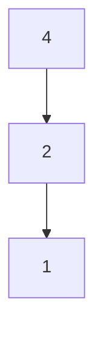

# Chapter 5. ２分木探索

Haskell の動作を理解しやすくするために、簡単な２分木探索のプログラムを実行してみます。

以下が２分木を生成するプログラムとなります。
```Haskell
data Tree a =
    Node a (Tree a) (Tree a)
    | Nil
    deriving Show
```

ghci で試す場合は、以下のように１行で書いてください。
```
ghci> data Tree a = Node a (Tree a) (Tree a) | Nil deriving Show
```

次に、以下のような実際に木構造を作ってみます。
