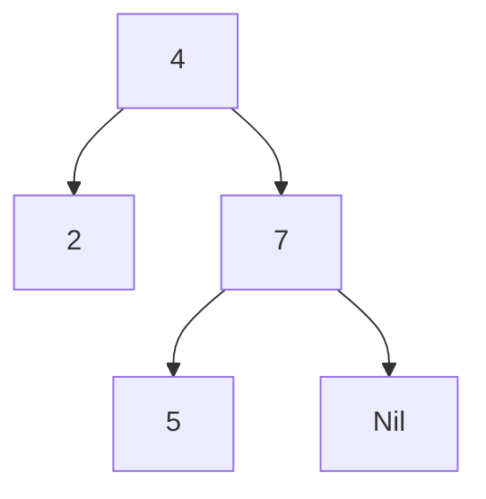

# Chapter 5. ２分木探索

Haskell の動作を理解しやすくするために、簡単な２分木探索のプログラムを作成してみます。

以下が２分木を生成するプログラムとなります。<br>
学習のために、一般的に Haskell で定義される２分木と少し形を変えています。
```Haskell
data Tree a =
    Node a (Tree a) (Tree a)
    | Leaf a
    | Nil
    deriving Show
```

ghci で試す場合は、以下のように１行で書いてください。
```
ghci> data Tree a = Node a (Tree a) (Tree a) | Leaf a | Nil deriving Show
```
`Tree` の定義で、留意すべきことは以下の２点になります。　

* `Tree a` と形変数 `a` が付随している。`Tree` は何かを格納するものなので、格納する型を `a` と表している。

* 型構築子と値構築子がうまく組み合わされている。<br>
`Node a (Tree a) (Tree a)` と書くことにより、`Node a A B` の `A` や `B` の部分には、
`Leaf a` が入っても良いし、`Nil` が入っても良い。さらに、再帰的に `Node a X Y` が入っても良い。

次に、以下のような実際に木構造を作ってみます。


```
ghci> t = Node 4 (Leaf 2) (Node 7 (Leaf 5) Nil)
```

> *２分木を知らない方へ*<br>
> ２分木とは、上の図にあるように、Node（結び目）のところにあるものより小さいものは左側へ、
> 大きいものは右側へ格納していく構造のものです。
