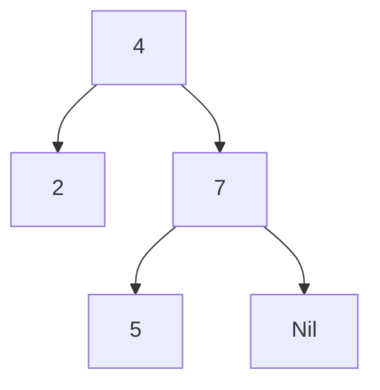
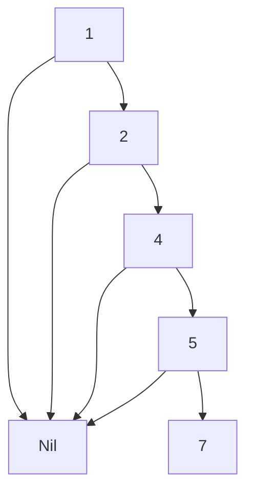

# Chapter 5. ２分木探索

Haskell の動作を理解しやすくするために、簡単な２分木探索のプログラムを作成してみます。

**２分木** とは、下の 図Ａ にあるように、Node（結び目）のところにあるものより小さいものは左側へ、
大きいものは右側へ格納していく構造のものです。

**図Ａ**


## ２分木のデータ構造を作る

以下が２分木を生成するプログラムとなります。<br>
学習のために、一般的に Haskell で定義される２分木と少し形を変えています。

**Tree.hs**
```Haskell
data Tree a =
    Node a (Tree a) (Tree a)
    | Leaf a
    | Nil
    deriving Show
```

`Tree` の定義で、留意すべきことは以下の２点になります。　

* `Tree a` と形変数 `a` が付随している。`Tree` は何かを格納するものなので、格納する型を `a` と表している。

* 型構築子と値構築子がうまく組み合わされている。<br>
`Node a (Tree a) (Tree a)` と書くことにより、`Node a A B` の `A` や `B` の部分には、
`Leaf a` が入っても良いし、`Nil` が入っても良い。さらに、再帰的に `Node a X Y` が入っても良い。

次に、図Ａ の木構造を `Tree a` を使って実際に作ってみると以下のようになります。

**リスト１**
```
ghci> :l Tree.hs
ghci> t = Node 4 (Leaf 2) (Node 7 (Leaf 5) Nil)
ghci> t
Node 4 (Leaf 2) (Node 7 (Leaf 5) Nil)
```
## ２分木に要素を追加する関数 `treeIns` を作る

リスト１で作った `t` に対して新しい要素 `1` を追加したい場合、`treeIns t 1` として要素を追加できるような関数を作ってみましょう。<br>

**リスト２（Tree.hs に追記）**
```Haskell
treeIns Nil x = Leaf x

treeIns (Leaf a) x
   | x == a = Leaf a
   | x < a  = Node a (Leaf x) Nil
   | x > a  = Node a Nil (Leaf x)

treeIns (Node a l r) x
   | x == a = Node a l r
   | x < a  = Node a (treeIns l x) r
   | x > a  = Node a l (treeIns r x)
```

リスト２では、新しい文法を使っています。

通常、関数は `関数名 引数 = 評価式` の形で定義しますが、引数によって評価式を分けたい場合、以下のように書くことができます。<br>
```
関数名 引数
    | 引数の条件１ = 評価式
    | 引数の条件２ = 評価式
    | ...         = 評価式
    | otherwise   = 評価式（この行は省略可能）
```
最後の行の `otherwise` は、`if` でいうと `else` の役割を果たします。関数型言語では、必ず評価値を返す必要があるため、どの条件にも当てはまらない場合、何もしない、ということができないので注意が必要です。<br>
`treeIns` の場合は、条件式のいずれかが必ず成立するため `otherwise` を省略できます。

このように、引数で分岐させることを **ガード（guard）** といいます。

---
`treeIns t 1` とした場合のパターンマッチは以下のように進みます。

　`treeIns t 1` ＝ `treeIns (Node 4 (Leaf 2) (Node 7 (Leaf 5) Nil)) 1  ← (ア)`  

(ア) は、`treeIns (Node a l r) x` にマッチ。  
`treeIns (Node 4 l r) 1`　（`l = Leaf 2`, `r = Node 7 (Leaf 5) Nil)`）<br>
と解釈され、ガードで分岐をして、以下のように評価されます。

　`treeIns (Node 4 l r) 1 = Node 4 (treeIns l 1) r`

`treeIns l 1` は、`treeIns (Leaf 2) 1` であるので、`treeIns (Leaf a) x` にマッチ。  
ガードで分岐をして、以下のように評価されます。

　`treeIns (Leaf 2) 1 = Node 2 (Leaf 1) Nil`
 
以上により、`treeIns t 1` の評価値は `Node 4 (Node 2 (Leaf 1) Nil) (Node 7 (Leaf 5) Nil))` となります。

---
実際に実行してみると、以下のようになります。
```Haskell
ghci> :l Tree.hs
ghci> t = Node 4 (Leaf 2) (Node 7 (Leaf 5) Nil)

ghci> treeIns t 1
Node 4 (Node 2 (Leaf 1) Nil) (Node 7 (Leaf 5) Nil)  ← (イ)
```

`treeIns` と `foldl` を利用すると、上の (イ) を次のようにして生成することができます。
```
ghci> foldl treeIns Nil [4,2,1,7,5]
Node 4 (Node 2 (Leaf 1) Nil) (Node 7 (Leaf 5) Nil)
```

２分木は、与える値の集合が同じであっても、与え方によってできあがる木構造が異なる、ということも知っておくと良いと思います。
```
ghci> foldl treeIns Nil [1,2,4,5,7]
Node 1 Nil (Node 2 Nil (Node 4 Nil (Node 5 Nil (Leaf 7))))
```
上の木は、右側ばかりに成長した木となります。

